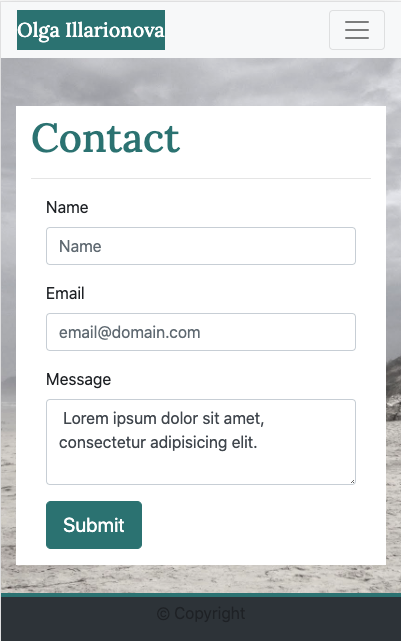

# Portfolio
## Responsive Portfolio

Website that will contain my portfolio.
The main goal of project was to create responsive site that look good on all devices. It was done using Bootstrap grid system.

### How it look?
Here a screenshots for different screen sizes.

### Where to look?

My [portfolio](https://myau5x.github.io/portfolio_resp/)

### Files and directories 

- `index.html` &ndash; basic information about me
- `portfolio.html` &ndash; my portfolio, now empty
- `contacts.html` &ndash; form to contact me
- `ctyle.css` &ndash; contains some styles that overwrite default bootstrap styles
- `images` &ndash; contains photos used on website

### What I used 

Website is developed with Bootstrap.

Photos are done by myself.

Placeholder images  are coming from site <https://placeholder.com/>
